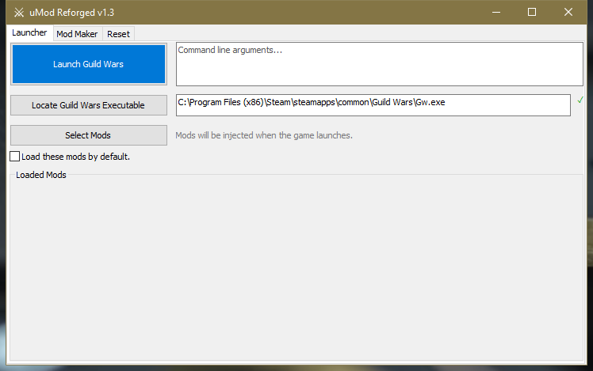

# uMod Reforged

uMod Reforged is a modern revival of the classic uMod texture modding tool for Guild Wars. This project keeps the original spirit of lightweight texture injection while making the day-to-day experience more dependable on modern systems.

[Download the latest release](https://github.com/gkoogz/uMod-Reforged/releases/latest)



Highlights in this refreshed version include:

- Updated interface for a cleaner, more approachable workflow.
- Steam compatibility so Guild Wars players can launch and mod through current distribution platforms.
- Broad bug fixes that address long-standing rough edges and reduce unexpected behavior.
- UI enhancements that improve clarity and reduce setup friction.
- Stability improvements aimed at more consistent sessions and fewer crashes.
- A reset button that clears corrupted settings and force-quits corrupted Guild Wars processes, making recovery from bad states fast and reliable.
- Caveat: packages created by uMod Reforged are not currently backwards compatible with TexMod.

Whether you are coming back to Guild Wars after years away or maintaining a long-running setup, uMod Reforged is focused on preserving the Guild Wars texture-modding workflow while improving usability.

## Legacy README

The content below is preserved from the legacy project documentation.

The licence is set for each file separately.

### 1. How to compile the GUI

#### 1.1. You need

- wxWidgets 2.9. An earlier version will not work because this project uses wxString functions only available in 2.9.

In the package a makefile for gcc (`makefile.gcc`) and a makefile for the MS Visual C Compiler (`makefile.vc`) is included, but you can generate your own makefile for the compiler of your choice.

Compiling wxWidgets:

- Compile it with `BUILD=release`; otherwise the executable will be very large.
- The vc compiler somehow generates a smaller executable.
- Set the linkage to static in `config.gcc` or `config.vc` before compiling wxWidgets to ensure that the executable runs on other PCs.

If you use the included makefiles, change the `WX_DIR` variable to your wxWidgets directory. This variable is near the beginning of the makefiles.

Note: static linkage is set in the corresponding `config.*` files. If wxWidgets was not compiled with static linkage, the compiler will fail when linking the GUI.

#### 1.2. Using gcc

Change into the `uMod_GUI` directory and run:

```bat
mingw32-make -f makefile.gcc BUILD=release
```

With `-j 4`, you can compile simultaneously with four threads.

#### 1.3. Using vc

Change into the `uMod_GUI` directory and run:

```bat
nmake -f makefile.vc BUILD=release
```

You need to use the special MS Visual prompt.

### 2. How to compile the DLL

#### 2.1. You need

- The DirectX SDK, June 2010.
- MS Visual C Compiler.
- Possibly the Microsoft Windows SDK.

There are two makefiles: one for `mingw32-make.exe` (`makefile.gcc`), which calls the vc compiler, and one for `nmake.exe` (`makefile.vc`), which also calls the vc compiler. The `makefile.gcc` file exists to use the `-j 4` option of GNU make.

You have to compile the three DLLs separately, one for each injection method. The DLL will be copied after successful compilation into the `uMod_GUI/bin` directory.

If you want to use the logging mode of the DLL, parse `LOG_MESSAGE=1`.

#### 2.2. Using gcc

You still need the vc compiler. Change into the `uMod_DX9` directory and run:

```bat
mingw32-make -f makefile.gcc
mingw32-make -f makefile.gcc DI=1
mingw32-make -f makefile.gcc NI=1
```

You need to use the special MS Visual prompt. With `-j 4`, you can compile simultaneously with four threads.

#### 2.3. Using vc

Change into the `uMod_DX9` directory and run:

```bat
nmake -f makefile.vc
nmake -f makefile.vc DI=1
nmake -f makefile.vc NI=1
```

You need to use the special MS Visual prompt.
